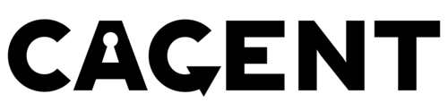

<p align="center">
  <picture>
    <source media="(prefers-color-scheme: dark)" srcset="img/logo-dark.png">
    
  </picture>
  <br>
  Agent in a cage.
</p>

Locks down the network and filesystem so an agent is free to explore the mounted workspace while reducing the risk of it going off the rails. 

## Getting started

### Install

```
git clone https://github.com/noperator/cagent && cd cagent
docker build -t cagent .
```

### Configure

Enter the agent's intended workspace on the host, and save a list of patterns that should be excluded from the agent's mounted filesystem.

```
echo '*.bak' > .agentignore
```

### Usage

```
<CAGENT-DIR>/run.sh
```

### Troubleshooting

This project is an experimental work in progress. There are likely more opportunities to lock this down further.

## Back matter

### See also

- https://github.com/trailofbits/claude-code-devcontainer
- https://github.com/RchGrav/claudebox
- https://github.com/anthropics/claude-code/tree/main/.devcontainer
- https://www.anthropic.com/engineering/claude-code-sandboxing

### To-do

<details><summary>Completed</summary>

- [x] specify domains at runtime
- [x] git-aware read-only mounts
- [x] refresh firewall after init
- [x] quiet down logging a bit
- [x] make ignore/readonly configurable

</details>
